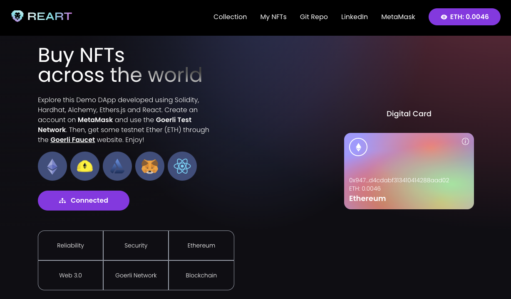
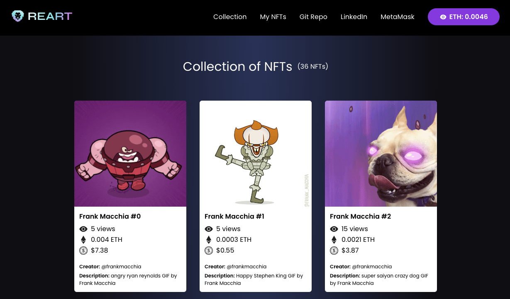
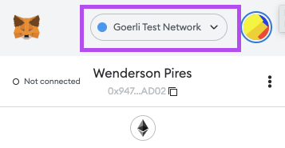

## 

Reart is a project focused on Web3. The idea was to create a Demo Platform where users could buy NFTs and for that I would need to study new technologies (and I love learning new things). Up until the point of this project, Solidity was a new language for me and I'm still studying it. I know there are many resources to be explored yet, but I used what I know in this project.

This project uses only a Smart Contract to make the transactions and each user (and user resource) is identified by the information collected from the transactions by the blockchain. Remember, it's a Demo application.

**Stack/Resources:** TypeScript, Solidity, Hardhat, Alchemy, Ethers.js, React, MetaMask, Cloud Firestore (used for views and collections control), Firebase Hosting

<a href="https://reart-web3-dapp.web.app/" target="_blank">**The platform is live here. Click here to access it!**</a>

You can also watch this presentation in English: <a href="https://drive.google.com/file/d/16dZqnWxNsexzO9KicCh7Akyte4iRiycw/view?usp=sharing" target="_blank">**Reart: A short presentation**</a>.

## How To Use

You must install <a href="https://metamask.io/" target="_blank">**MetaMask**</a> and create a wallet. It is also necessary that you use the **Goerli Test Network** (this platform only works with this network):

Then, get some testnet Ether (ETH) through the <a href="https://goerlifaucet.com/" target="_blank">**Goerli Faucet**</a> website. At this point you are ready to use the platform.

## Good to Know

1 - Logo and some aspects of the UX/UI of the application were made by <a href="https://www.linkedin.com/in/brunoteodoro/" target="_blank">**Bruno Teodoro**</a>.

2 - The review of the demo product and presentation was made by <a href="https://www.linkedin.com/in/lucas-alves-s/" target="_blank">**Lucas Souza**</a>.

3 - Here's my main source of study about Web3 stuff: <a href="https://www.youtube.com/watch?v=Wn_Kb3MR_cU" target="_blank">**JavaScript Mastery**</a>, <a href="https://fireship.io/lessons/web3-solidity-hardhat-react-tutorial/" target="_blank">**Fireship**</a> and this <a href="https://www.udemy.com/course/blockchain-developer/" target="_blank">**Blockchain Developer**</a> course on Udemy.
